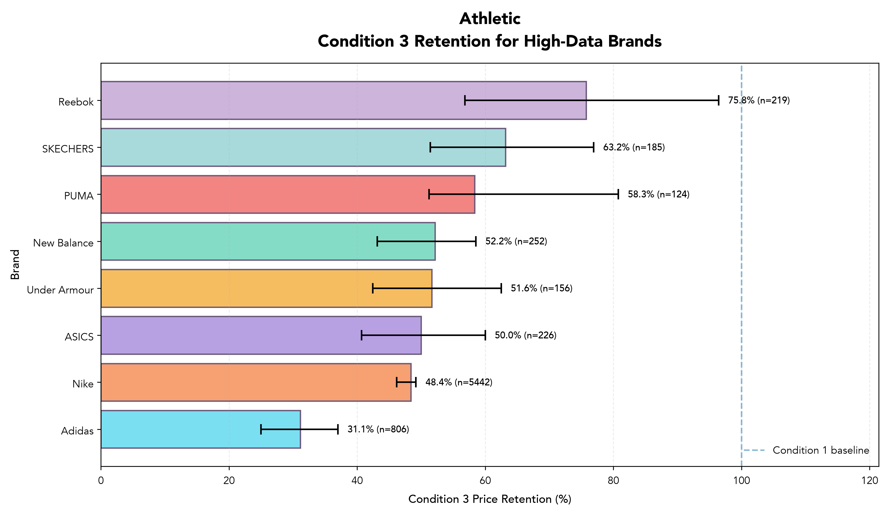

# Mercari Women’s Shoe Condition & Price Resilience Analysis

## Project Overview

This project analyzes how women’s shoe listing prices on Mercari change as item condition worsens.

Rather than ranking brands against one another, the analysis examines each brand within a specific shoe type and compares its own median listing prices across condition groups.

The main question is:

> How does a brand’s median listing price change from Condition 1 to lower-condition listings within the same shoe category?

The project currently focuses primarily on the change from **Condition 1 to Condition 3**, because these groups contain enough listings to support more reliable comparisons.

## Dataset

The original dataset is the Mercari Price Suggestion Challenge dataset. It contains approximately **1.48 million marketplace listings**.

After narrowing down the total marketplace listings to **77,654 women’s shoe listings**, the dataset was filtered and cleaned to keep out listings with missing/blank brand names and/or a price of $0, and the final dataset contained **53,176 women’s shoe listings**.

## Shoe Categories

The project analyzes **seven** shoe types:

- Athletic
- Boots
- Sandals
- Fashion Sneakers
- Pumps
- Flats
- Loafers & Slip-Ons

Each brand is analyzed separately within each shoe type.

## Data Cleaning

The cleaning process included:

- Filtering the original dataset to women’s shoes
- Removing missing or blank brand names
- Removing zero-price listings
- Standardizing shoe categories into seven shoe types
- Combining original condition levels 4 and 5
- Saving the cleaned dataset as a Parquet file

The final condition groups are Condition 1 (best), Condition 2, Condition 3, and Condition 4–5 (worst).

## Methodology

For every brand and shoe-type combination, the analysis calculates listing counts, median listing prices, and price retention relative to Condition 1.

Median price is used because it is less sensitive than the mean to unusually high or low marketplace listings.

### Price Retention

```text
Condition 3 Median Price
------------------------- × 100
Condition 1 Median Price
```

A retention value of **65%** means that the brand’s Condition 3 median listing price is 65% of its own Condition 1 median listing price within the same shoe type.

A value above 100% is labeled as a **non-monotonic price pattern**. It does not mean that worse condition increases value. These cases may reflect differences in models, styles, listing composition, or seller-reported condition.

## Minimum Sample Requirement

A brand and shoe-type combination must have at least 10 Condition 1 listings and 10 listings in a comparison condition.

## What Are “High-Data Brands”?

The visualizations display up to eight **high-data brands** for each shoe category.

“High-data brands” are the brands with the largest combined number of qualifying Condition 1 and Condition 3 listings within that shoe type.

```text
Combined sample size =
Condition 1 listing count + Condition 3 listing count
```

These brands are selected because they have more available data, not because they have the highest prices or the best condition retention.

The charts should therefore not be interpreted as rankings of the “best” brands. The high-data selection is used only to create clearer and more reliable comparisons.

## Example Visualization

The chart below shows Condition 3 price retention for high-data Athletic shoe brands. Each percentage compares a brand’s Condition 3 median listing price with that same brand’s Condition 1 median listing price.

The brands shown were selected based on sample size, not price or retention performance.



## Visualizations

Two charts are created for every shoe category:

1. **Condition 1 to Condition 3 Price Change**  
   A slope chart showing each high-data brand’s Condition 1 and Condition 3 median listing prices.

2. **Condition 3 Price Retention**  
   A horizontal bar chart showing Condition 3 median price as a percentage of the brand’s own Condition 1 median price.

Charts are saved in:

```text
outputs/charts/
```

## Project Structure

```text
mercari-shoe-resale-analysis/
├── data/
│   ├── raw/
│   │   └── train.tsv
│   └── processed/
│       ├── clean_womens_shoes.parquet
│       └── brand_shoe_condition_retention.parquet
├── notebooks/
│   ├── 01_data_exploration.ipynb
│   ├── 02_shoe_data_cleaning.ipynb
│   ├── 03_exploratory_brand_tiers.ipynb
│   ├── 04_condition_retention_analysis.ipynb
│   └── 05_condition_visualizations.ipynb
├── outputs/
│   ├── charts/
│   └── tables/
│       └── brand_shoe_condition_retention.csv
├── .gitignore
├── requirements.txt
└── README.md
```

## Notebook Workflow

### `01_data_exploration.ipynb`

Explores dataset dimensions, missing values, category structure, brand frequency, prices, and item conditions.

### `02_shoe_data_cleaning.ipynb`

Filters and cleans the women’s shoe data, creates broader shoe types and condition groups, and saves the processed dataset.

### `03_exploratory_brand_tiers.ipynb`

Contains an earlier exploratory brand-tier approach. It is retained to document the development process but is not part of the final methodology.

### `04_condition_retention_analysis.ipynb`

Calculates listing counts, median prices, condition-retention percentages, and expected versus non-monotonic patterns.

### `05_condition_visualizations.ipynb`

Creates the final slope charts and retention-percentage charts for all seven shoe categories.

## Current Findings

Approximately **92.6%** of the analyzed brand and shoe-type combinations showed an expected decline pattern, while **7.4%** showed a non-monotonic pattern.

These results should be interpreted cautiously because the dataset does not identify identical shoe models across condition groups.

## Limitations

- Mercari prices are listing prices, not confirmed sale prices
- Original retail prices are unavailable
- Different models and styles may be grouped under one brand
- Product age is unavailable
- Authenticity cannot be verified
- Condition is seller-reported and subjective
- Shipping and listing strategy may influence prices
- Price retention is descriptive, not literal depreciation

## Tools Used

Python, pandas, matplotlib, Jupyter Notebook, VS Code, Git, GitHub, and Parquet.
